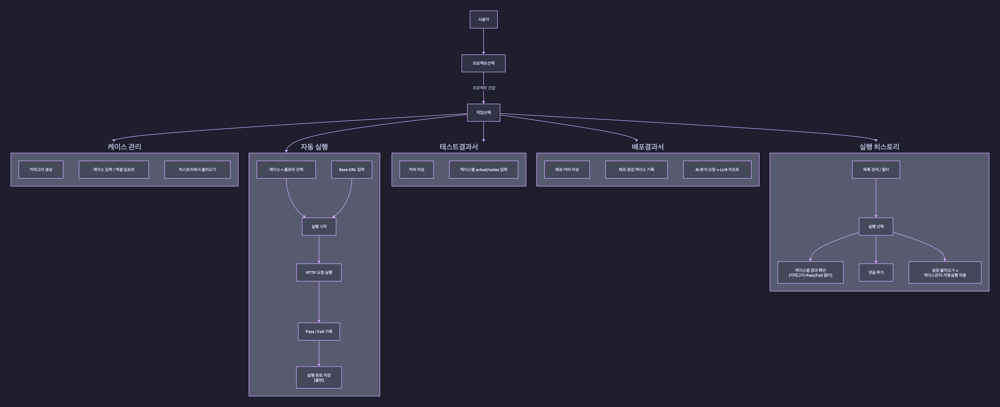
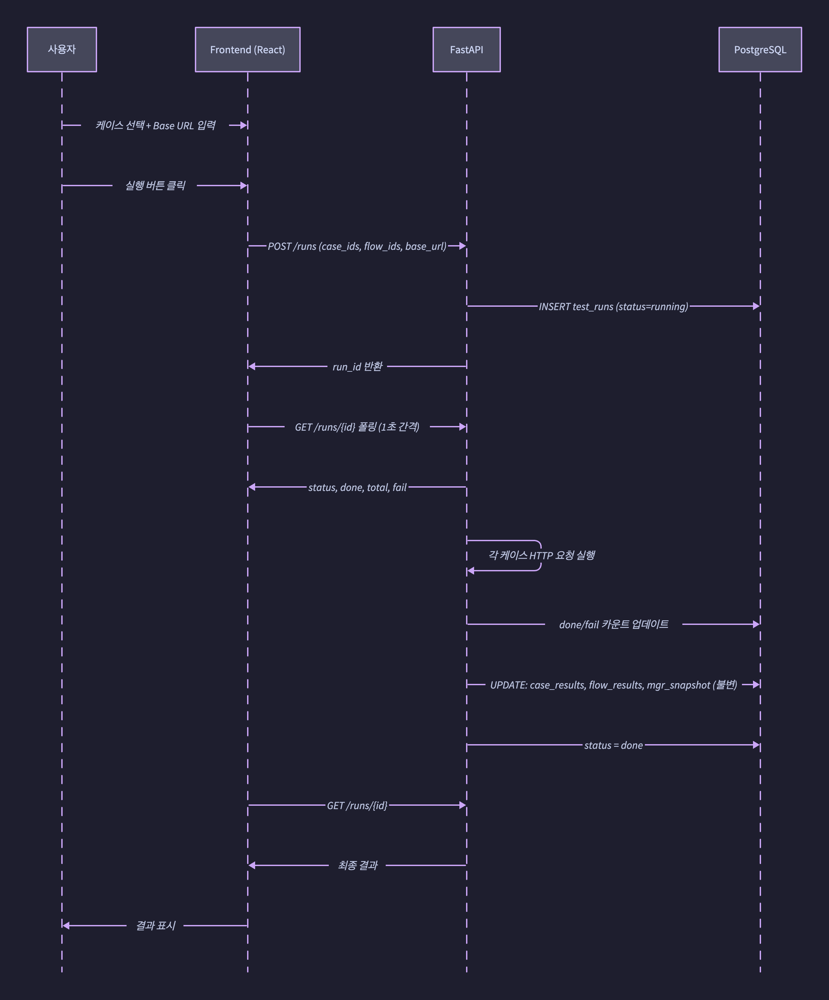
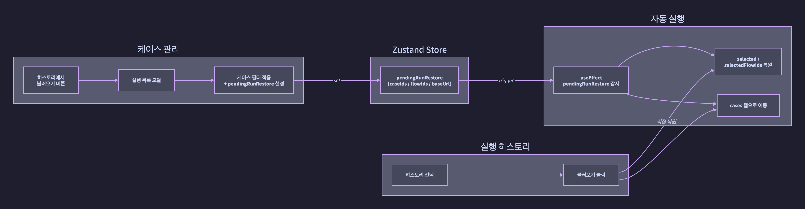
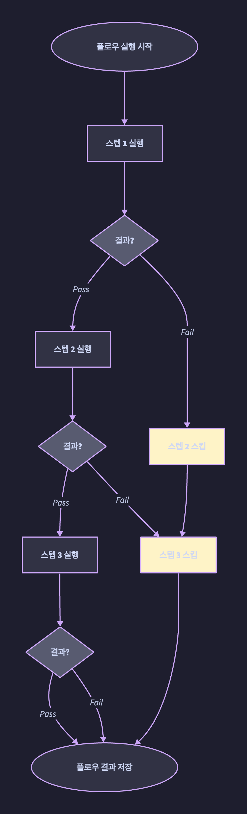
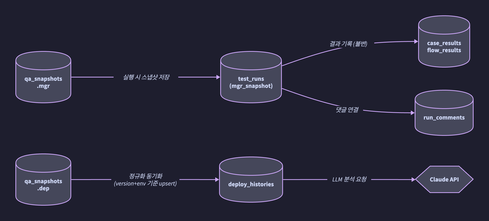
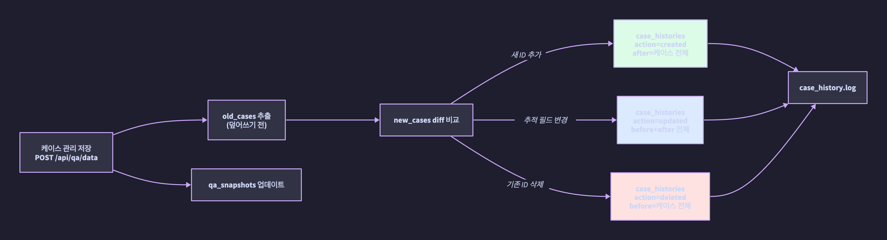
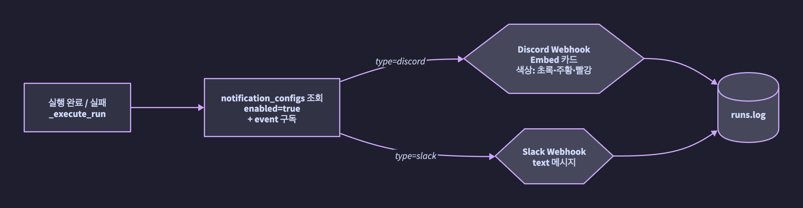

<div align="center">

# 🧪 Single\_QA\_Tools

**테스트 케이스 관리 · 자동 실행 · 배포 점검을 하나의 인터페이스에서**

[](https://fastapi.tiangolo.com)
[](https://react.dev)
[](https://www.typescriptlang.org)
[](https://www.postgresql.org)
[](https://tailwindcss.com)

</div>

---

## 개요

**Single_QA_Tools**는 소규모 개발팀 또는 개인 QA 담당자를 위한 통합 QA 관리 도구입니다.
테스트 케이스 설계부터 자동화 실행, 결과 문서화, 배포 점검까지 하나의 UI에서 처리할 수 있으며,
실행 이력은 **불변(immutable)** 으로 보관되어 언제든 감사(Audit)가 가능합니다.

---

## 주요 기능

### 🗂️ Test Suite
- 비즈니스 로직 단위로 케이스·플로우를 묶은 **스위트** 생성·관리
- 스위트 화면에서 케이스를 **직접 추가·수정·삭제** 가능 — 케이스 관리 탭과 실시간 동기화
- 체크박스 토글로 스위트 포함/제외 즉시 DB 반영 (자동 저장)
- 기본 스위트(`★`) 지정 — 프로젝트 진입 시 자동 로드
- **Additive 불러오기** — 여러 스위트·히스토리를 합산(union) 조합, 칩 단위 해제 가능

### 📋 케이스 관리
- 카테고리 단위로 테스트 케이스 구조화 관리
- **Postman 표준 방식**으로 케이스별 실행 파라미터 입력 (Base URL / Method / Endpoint / Headers / Query Params / Body)
- 케이스별 Base URL 개별 지정 가능 — 비워두면 전역 URL 자동 fallback
- **성공 판정 조건(Assertions)** 설정 — 상태코드 · Body JSON 경로 · Body 텍스트 · 헤더를 조건으로 Pass/Fail 자동 판정
- 연동규격서 **엑셀 임포트** 지원
- 스위트·히스토리 **복수 소스 additive 불러오기** — 합산(union) 필터, 칩 단위 개별 해제

### ⚡ 자동 실행
- 개별 케이스 + **테스트 플로우** 선택 후 실제 HTTP 요청 자동 실행
- **전역 설정**(Base URL, 기본 헤더 KV) + **케이스별 개별 설정** 공존 — 케이스 설정이 전역보다 우선
- Assertions 설정 시 상태코드 + 모든 조건 동시 충족 여부로 Pass/Fail 자동 판정
- 실행 완료 후 결과(`case_results`, `flow_results`, `mgr_snapshot`) **불변 저장**
- 실시간 진행률 폴링 (1초 간격)

### 🔔 알림 설정
- 프로젝트별 **Discord / Slack 웹훅** 복수 등록
- 구독 이벤트 선택: `실행 완료` / `실행 오류`
- 알림 메시지 내용: 프로젝트명 · 실행 레이블 · 통과/실패 수 · 실패 케이스 목록 · 플로우 결과 + 문서 형식 요약 보고서
- **Discord Excel 첨부** — 설정 시 실행 완료 알림에 테스트 수행 내역서 `.xlsx` 파일을 자동 첨부 (openpyxl 서버 사이드 생성)
- Slack Incoming Webhook은 파일 첨부 미지원 — UI에서 안내 메시지 표시
- 테스트 전송 버튼으로 웹훅 즉시 검증
- 알림 설정 페이지에서 **메시지 미리보기** 확인 가능 (Discord / Slack 탭 전환)
- 활성화 / 비활성화 토글

### 🔁 테스트 플로우
- 업무 흐름 단위로 케이스를 순서대로 묶은 플로우 정의
- **Stop-on-fail** — 스텝 실패 시 이후 스텝 자동 스킵
- 플로우 단위 성공/실패 결과 별도 기록

### 📊 실행 히스토리
- 모든 자동 실행 이력 시계열 보관
- Pass / Fail 필터 + **카테고리 필터** 동시 지원
- 케이스 행 클릭 시 actual / notes 인라인 확인
- 실행 단위 **댓글** 추가 (추가 전용, 감사 목적)
- 히스토리 설정 → 케이스관리 / 자동실행 **양방향 복원**

### 📄 테스트결과서 / 배포결과서
- 테스트 완료 결과를 커버 페이지 포함 문서 형식으로 정리
- 배포 버전 / 환경 / 유형(정기·긴급·롤백 등) 분류 기록
- **AI 분석** — 분석 모달에서 LLM 프로바이더를 **실시간 선택** (Local Ollama / Claude API)
  - `Local (Ollama)`: 로컬 설치 모델 — `ollama serve` 실행 필요
  - `Claude API`: Anthropic 외부 API — `ANTHROPIC_API_KEY` 환경변수 필요
  - > ⚠️ **샘플 구현** — 분석 프롬프트 및 응답 품질은 선택한 모델에 따라 크게 달라집니다. 실 운영 시 프롬프트 튜닝 및 모델 선택을 별도로 진행하세요.

---

## 아키텍처

```
Browser (React SPA)
  └── Zustand (전역 상태: 선택 케이스, 프로젝트, pendingRunRestore)
        │
        ▼
FastAPI REST API
  ├── /api/projects        프로젝트 CRUD
  ├── /api/qa              QA 스냅샷 load/save (mgr · tst · dep 통합) + 케이스 변경 이력
  ├── /api/runs            자동 실행 생성 · 조회 · 폴링
  ├── /api/flows           테스트 플로우 CRUD
  ├── /api/suites          Test Suite CRUD + 기본 스위트 지정
  ├── /api/analytics       실행 분석 (기간 필터)
  ├── /api/notifications   Discord / Slack 웹훅 설정
  ├── /api/deploy          배포결과서 이력
  └── /api/analysis        LLM 분석 (Local Ollama | Claude API — 요청 시 프로바이더 선택)
        │
        ▼
PostgreSQL (9개 테이블)
  projects · qa_snapshots · test_flows · test_runs
  run_comments · case_histories · test_suites
  notification_configs · deploy_histories
```

---

## 다이어그램

### 전체 서비스 플로우



### 자동 실행 시퀀스



### 히스토리 복원 플로우



### 테스트 플로우 Stop-on-fail



### 데이터 저장 흐름



### 케이스 변경 이력 플로우



### 알림 전송 플로우



---

## 시작하기

### 사전 요구사항

- Docker & Docker Compose
- Python 3.11+
- Node.js 18+

### 1. 저장소 클론

```bash
git clone https://github.com/your-username/QASingle.git
cd QA-Server
```

### 2. 데이터베이스 실행

```bash
docker-compose up -d
```

PostgreSQL 16이 `localhost:5432`에서 시작됩니다.

### 3. 백엔드 실행

```bash
cd backend
python -m venv venv
source venv/bin/activate        # Windows: venv\Scripts\activate
pip install -r requirements.txt
alembic upgrade head            # DB 마이그레이션 적용
uvicorn main:app --reload
```

> API 서버: **http://localhost:8000**  
> Swagger 문서: **http://localhost:8000/docs**

### 4. 더미 데이터 삽입 (선택)

실제 화면을 바로 확인하고 싶다면 시드 스크립트를 실행합니다.  
백엔드 가상환경이 활성화된 상태에서 실행하세요.

```bash
cd backend
python seed.py
```

50개 프로젝트 · 각 프로젝트당 케이스 수십 개 · Test Suite 3종 · 실행 이력·댓글이 한 번에 생성됩니다.  
**주의**: 기존 데이터가 전부 삭제되고 새로 삽입됩니다.

### 5. 프론트엔드 실행

```bash
cd frontend
cp .env.example .env
npm install
npm run dev
```

> 앱: **http://localhost:5173**

---

## 환경 변수

`frontend/.env`

| 변수 | 기본값 | 설명 |
|---|---|---|
| `VITE_API_URL` | `http://localhost:8000` | FastAPI 서버 URL |

`backend/.env` (또는 실행 환경 변수)

| 변수 | 기본값 | 설명 |
|---|---|---|
| `LLM_PROVIDER` | `local` | 기본 LLM 백엔드 (`local` \| `claude`) — UI 드롭다운으로 요청별 override 가능 |
| `OLLAMA_URL` | `http://localhost:11434` | Ollama 서버 주소 |
| `OLLAMA_MODEL` | `llama3.2` | 사용할 로컬 모델명 |
| `ANTHROPIC_API_KEY` | — | Claude API 키 (claude 선택 시 필수) |
| `CLAUDE_MODEL` | `claude-sonnet-4-6` | 사용할 Claude 모델 ID |

---

## DB 마이그레이션 (Alembic)

스키마 변경은 `create_all()` 대신 Alembic으로 관리합니다.

```bash
cd backend
source venv/bin/activate

# 운영 DB에 최신 마이그레이션 반영
alembic upgrade head

# 모델 변경 후 새 마이그레이션 생성
alembic revision --autogenerate -m "변경 내용 설명"
alembic upgrade head
```

> `alembic.ini`의 `sqlalchemy.url` 기본값이 로컬 개발 DB로 설정되어 있습니다.  
> 운영 환경에서는 `DATABASE_URL` 환경변수를 설정하면 자동으로 우선 적용됩니다.

---

## 불변성 원칙

실행이 완료된 결과는 **절대 수정되지 않습니다.**

| 테이블 | 수정 가능 | 불변 |
|---|---|---|
| `test_runs` | `label` | `case_ids`, `flow_ids`, `case_results`, `flow_results`, `mgr_snapshot` |
| `run_comments` | — | `text`, `created_at` |

---

## 문서

- [테이블 정의서](docs/테이블정의서.md)
- [ERD](docs/ERD.md)
- [서비스 소개서](docs/서비스소개서.md)
- [서비스 플로우](docs/서비스플로우.md)

---

## 기술 스택 상세

| 영역 | 기술 |
|---|---|
| Frontend | React 18, TypeScript, Vite, Tailwind CSS v4, shadcn/ui |
| 상태관리 | Zustand, TanStack Query |
| UI 컴포넌트 | Radix UI, lucide-react, Sonner (toast) |
| Backend | FastAPI, SQLAlchemy 2.0, Pydantic v2, Alembic |
| Database | PostgreSQL 16 (Docker) |
| AI (LLM) | Ollama (로컬) / Anthropic Claude API (외부) — UI에서 요청별 선택 |
| 기타 | openpyxl (엑셀), httpx (HTTP 실행), Docker Compose |
