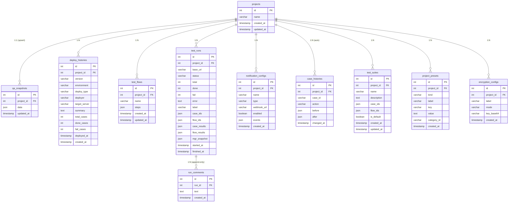

# QA-Server ERD

## 비고

| 관계 | 설명 |
|---|---|
| projects → qa_snapshots | 프로젝트당 1행 (upsert). mgr / tst / dep 전체 상태 저장 |
| projects → deploy_histories | qa_snapshots.dep 저장 시 정규화 동기화 (version+environment 기준 upsert) |
| projects → test_flows | 사용자 정의 순서형 케이스 묶음 |
| projects → test_runs | 자동 실행 1회 = 1행. case_results / flow_results / mgr_snapshot 불변 |
| projects → notification_configs | Discord / Slack 웹훅 설정. 여러 개 등록 가능 |
| projects → case_histories | 케이스 관리 저장 시 스냅샷 diff로 자동 생성. 수정·삭제 없음 |
| projects → test_suites | 케이스+플로우 묶음 스위트. is_default 설정 시 진입 시 자동 적용 |
| projects → project_presets | 저장된 값(헤더·URL·경로·파라미터·바디·판정조건경로). category_id로 카테고리 자동 적용 연결 |
| projects → encryption_configs | AES-256-GCM 암호화 키. project_presets와 별도 테이블로 분리 |
| test_runs → run_comments | 추가 전용 댓글. 수정·삭제 엔드포인트 없음 |
