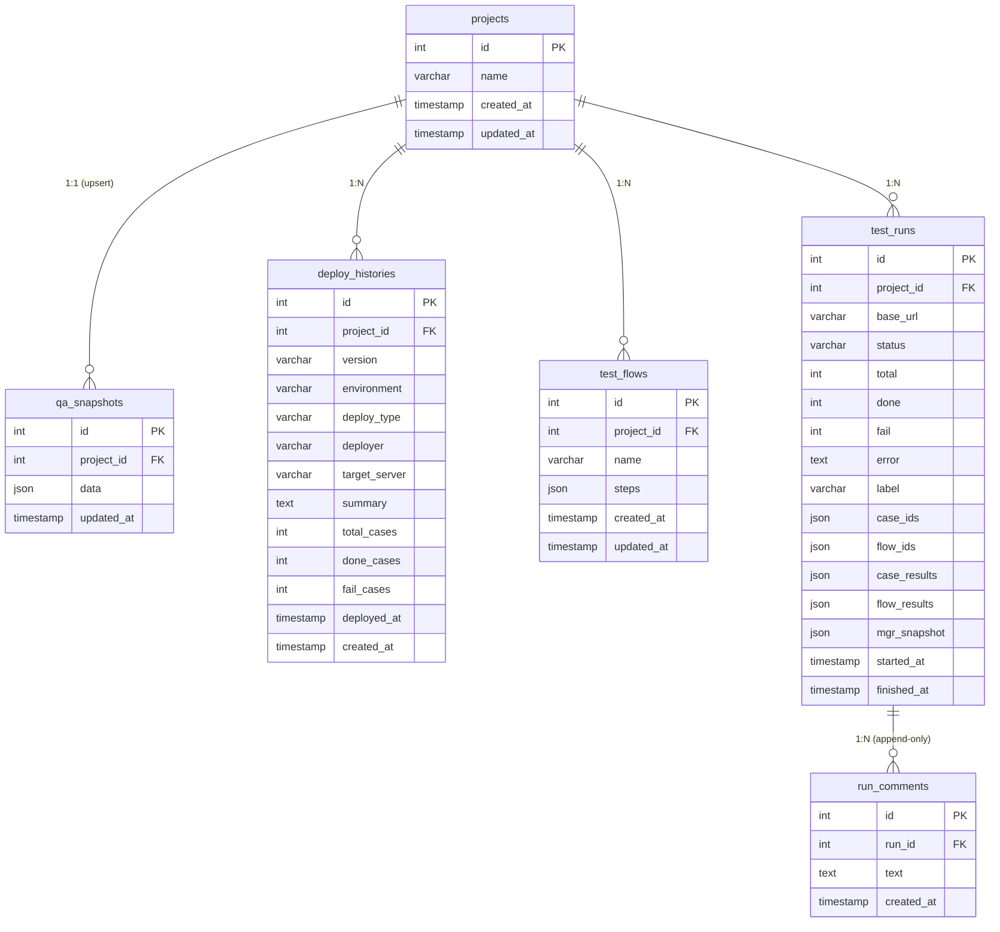

# QA-Server ERD

## 비고

| 관계 | 설명 |
|---|---|
| projects → qa_snapshots | 프로젝트당 1행 (upsert). mgr / tst / dep 전체 상태 저장 |
| projects → deploy_histories | qa_snapshots.dep 저장 시 정규화 동기화 (version+environment 기준 upsert) |
| projects → test_flows | 사용자 정의 순서형 케이스 묶음 |
| projects → test_runs | 자동 실행 1회 = 1행. case_results / flow_results / mgr_snapshot 불변 |
| test_runs → run_comments | 추가 전용 댓글. 수정·삭제 엔드포인트 없음 |
