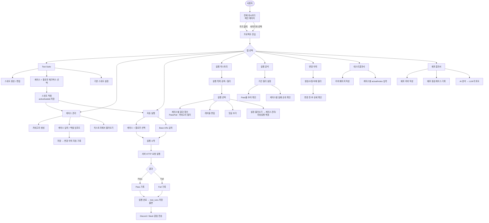
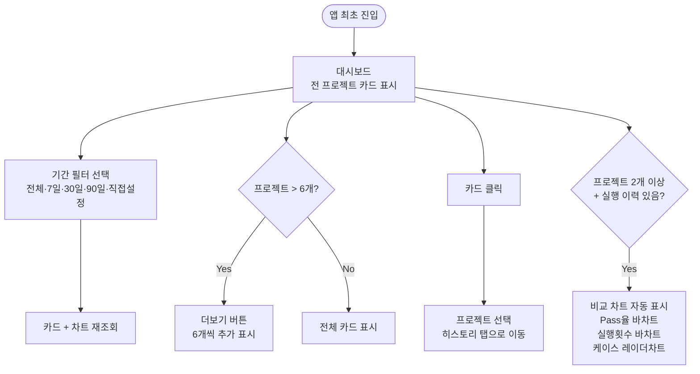
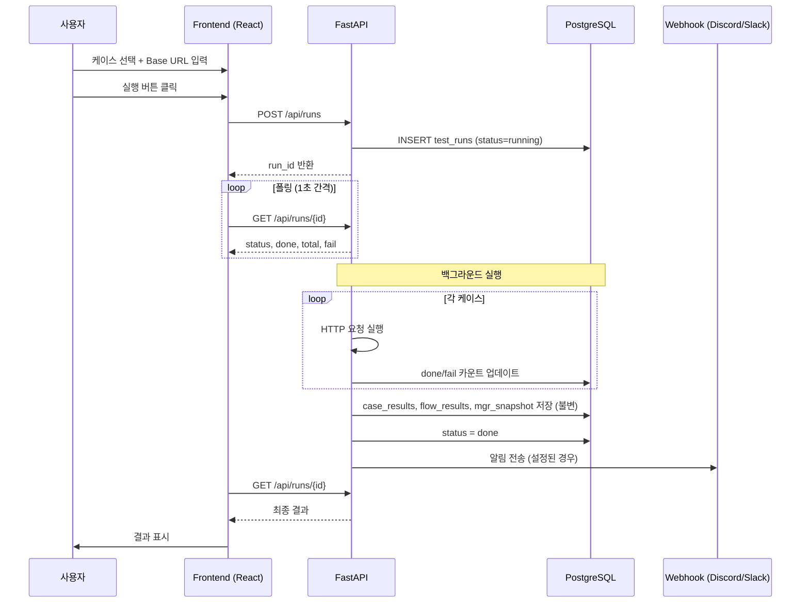
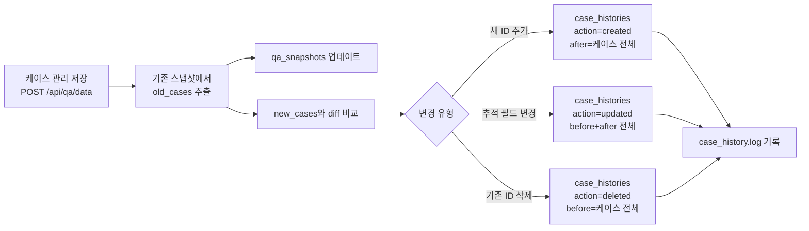
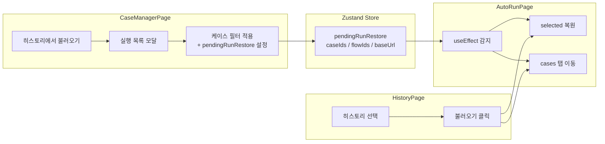
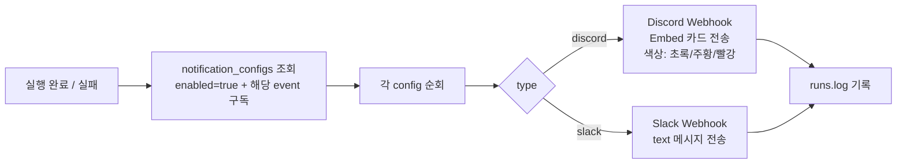
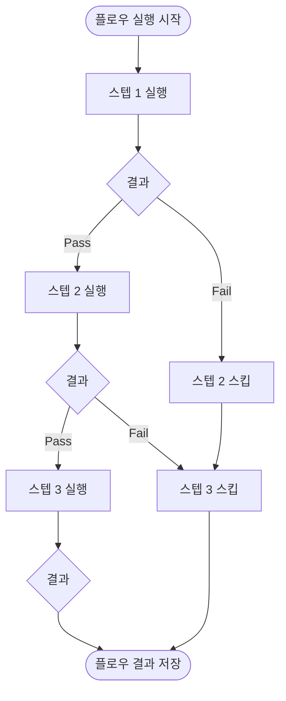
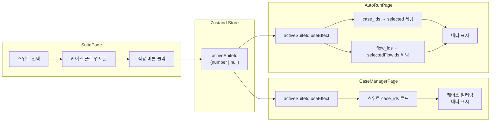
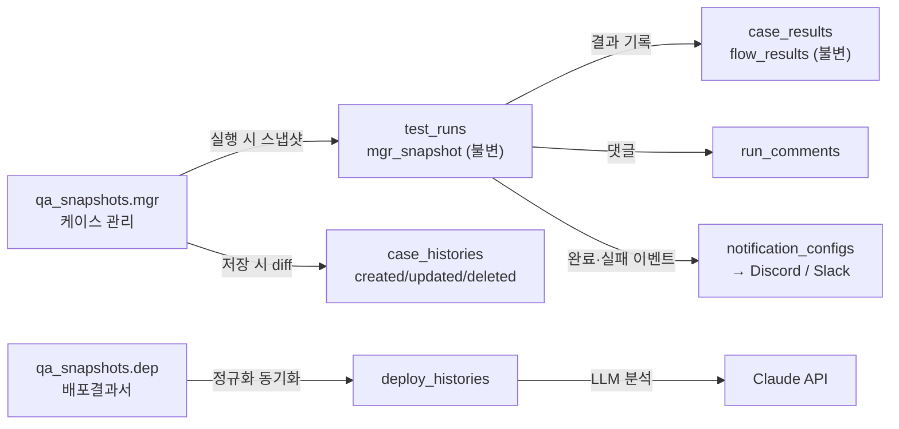

# QA-Server 서비스 플로우 다이어그램

---

## 1. 전체 서비스 플로우

---

## 2. 대시보드 플로우

---

## 3. 자동 실행 시퀀스

---

## 4. 케이스 변경 이력 자동 기록

---

## 5. 히스토리 불러오기 (Cross-page 동기화)

---

## 6. 알림 전송 플로우

---

## 7. 테스트 플로우 실행 (stop-on-fail)

---

## 8. Test Suite 동기화 플로우

---

## 9. 데이터 저장 흐름

