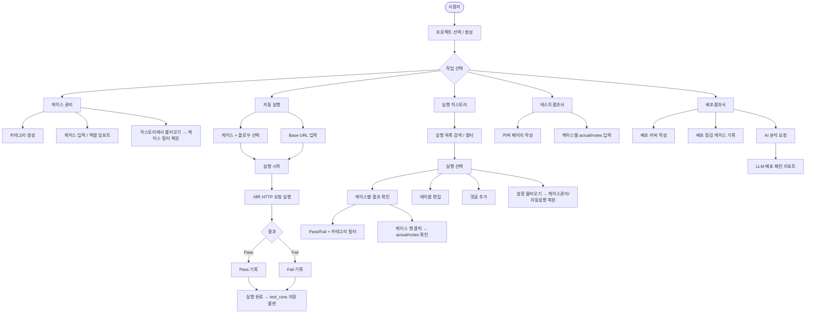
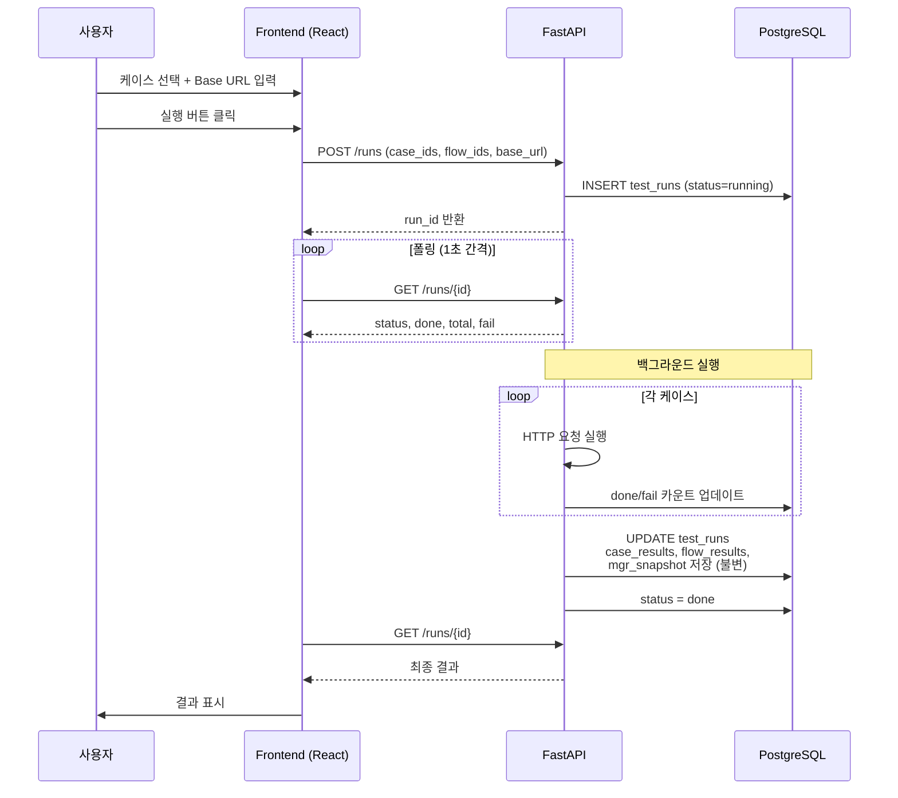
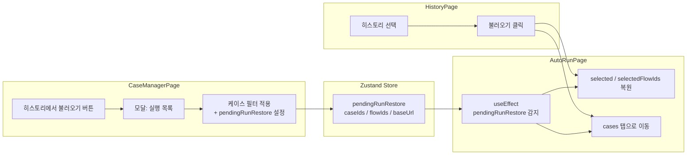
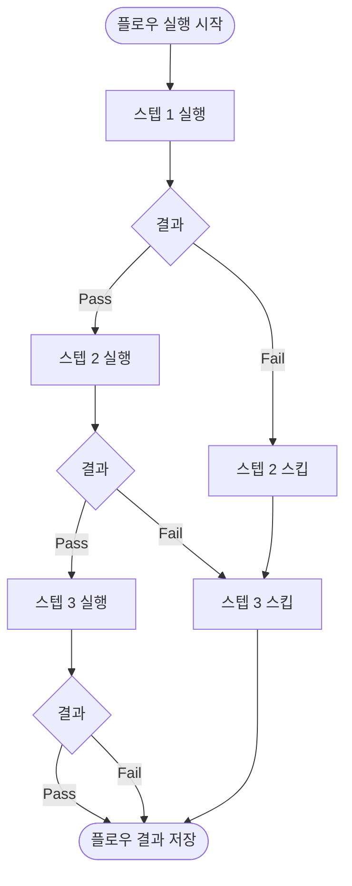
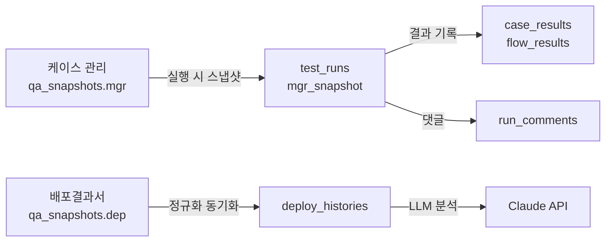

# QA-Server 서비스 플로우 다이어그램

---

## 1. 전체 서비스 플로우

```mermaid
flowchart TD
    A([사용자]) --> B[프로젝트 선택 / 생성]
    B --> C{작업 선택}

    C --> D[케이스 관리]
    C --> E[자동 실행]
    C --> F[실행 히스토리]
    C --> G[테스트결과서]
    C --> H[배포결과서]

    D --> D1[카테고리 생성]
    D --> D2[케이스 입력 / 엑셀 임포트]
    D --> D3[히스토리에서 불러오기 → 케이스 필터 복원]

    E --> E1[케이스 + 플로우 선택]
    E --> E2[Base URL 입력]
    E1 & E2 --> E3[실행 시작]
    E3 --> E4[서버 HTTP 요청 실행]
    E4 --> E5{결과}
    E5 -->|Pass| E6[Pass 기록]
    E5 -->|Fail| E7[Fail 기록]
    E6 & E7 --> E8[실행 완료 → test_runs 저장 불변]

    F --> F1[실행 목록 검색 / 필터]
    F1 --> F2[실행 선택]
    F2 --> F3[케이스별 결과 확인]
    F3 --> F4[Pass/Fail + 카테고리 필터]
    F3 --> F5[케이스 행 클릭 → actual/notes 확인]
    F2 --> F6[레이블 편집]
    F2 --> F7[댓글 추가]
    F2 --> F8[설정 불러오기 → 케이스관리/자동실행 복원]

    G --> G1[커버 페이지 작성]
    G --> G2[케이스별 actual/notes 입력]

    H --> H1[배포 커버 작성]
    H --> H2[배포 점검 케이스 기록]
    H --> H3[AI 분석 요청]
    H3 --> H4[LLM 배포 패턴 리포트]
```

---

## 2. 자동 실행 상세 플로우

```mermaid
sequenceDiagram
    participant U as 사용자
    participant FE as Frontend (React)
    participant API as FastAPI
    participant DB as PostgreSQL

    U->>FE: 케이스 선택 + Base URL 입력
    U->>FE: 실행 버튼 클릭

    FE->>API: POST /runs (case_ids, flow_ids, base_url)
    API->>DB: INSERT test_runs (status=running)
    API-->>FE: run_id 반환

    loop 폴링 (1초 간격)
        FE->>API: GET /runs/{id}
        API-->>FE: status, done, total, fail
    end

    Note over API,DB: 백그라운드 실행
    loop 각 케이스
        API->>API: HTTP 요청 실행
        API->>DB: done/fail 카운트 업데이트
    end

    API->>DB: UPDATE test_runs<br/>case_results, flow_results,<br/>mgr_snapshot 저장 (불변)
    API->>DB: status = done

    FE->>API: GET /runs/{id}
    API-->>FE: 최종 결과
    FE->>U: 결과 표시
```

---

## 3. 히스토리 불러오기 플로우 (Cross-page 동기화)

```mermaid
flowchart LR
    subgraph HistoryPage
        H1[히스토리 선택]
        H2[불러오기 클릭]
    end

    subgraph Zustand Store
        Z1[pendingRunRestore\ncaseIds / flowIds / baseUrl]
    end

    subgraph CaseManagerPage
        C1[히스토리에서 불러오기 버튼]
        C2[모달: 실행 목록]
        C3[케이스 필터 적용\n+ pendingRunRestore 설정]
    end

    subgraph AutoRunPage
        A1[useEffect\npendingRunRestore 감지]
        A2[selected / selectedFlowIds 복원]
        A3[cases 탭으로 이동]
    end

    H1 --> H2
    H2 --> A2
    H2 --> A3

    C1 --> C2
    C2 --> C3
    C3 --> Z1
    Z1 --> A1
    A1 --> A2
    A1 --> A3
```

---

## 4. 테스트 플로우 실행 (stop-on-fail)

```mermaid
flowchart TD
    S([플로우 실행 시작]) --> Step1

    Step1[스텝 1 실행] --> R1{결과}
    R1 -->|Pass| Step2
    R1 -->|Fail| Skip2

    Step2[스텝 2 실행] --> R2{결과}
    R2 -->|Pass| Step3
    R2 -->|Fail| Skip3

    Step3[스텝 3 실행] --> R3{결과}
    R3 -->|Pass| Done
    R3 -->|Fail| Done

    Skip2[스텝 2 스킵] --> Skip3
    Skip3[스텝 3 스킵] --> Done

    Done([플로우 결과 저장])
```

---

## 5. 데이터 저장 흐름

```mermaid
flowchart LR
    MGR[케이스 관리\nqa_snapshots.mgr] -->|실행 시 스냅샷| RUN[test_runs\nmgr_snapshot]
    RUN -->|결과 기록| CR[case_results\nflow_results]
    RUN -->|댓글| CMT[run_comments]

    DEP[배포결과서\nqa_snapshots.dep] -->|정규화 동기화| DH[deploy_histories]
    DH -->|LLM 분석| AI[Claude API]
```
